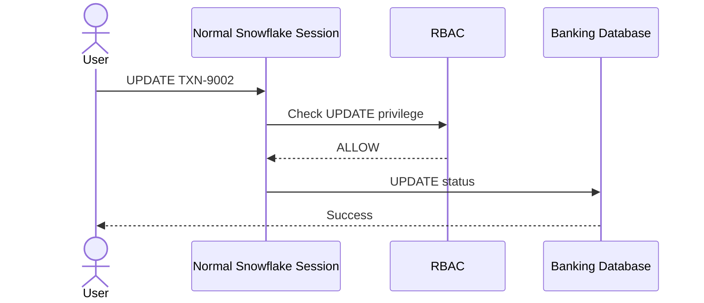
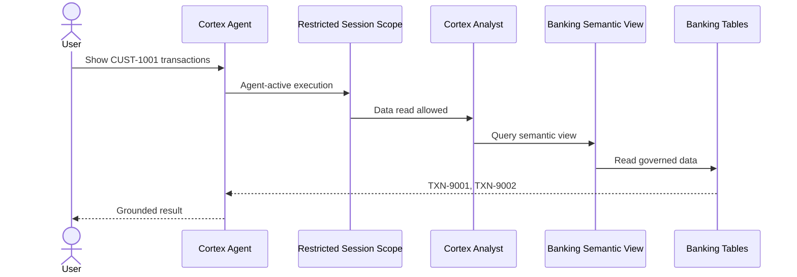
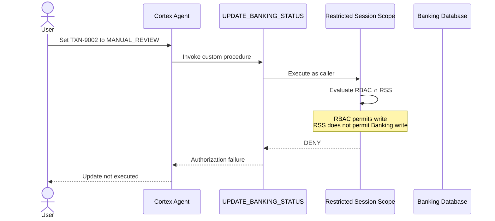
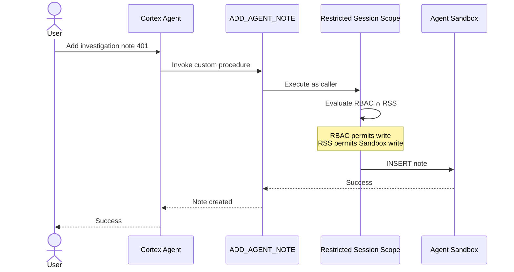
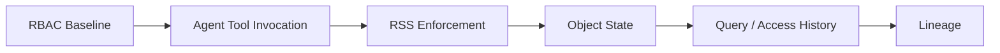

# Sequence Diagrams

GitHub renders the following Mermaid diagrams directly.

## 1. Human-session RBAC baseline

This establishes that the user's underlying RBAC role can write to the banking table.

## 2. Agent governed read

## 3. Agent production write — target DENY path

This diagram is a **target validation path** until runtime evidence confirms it.

## 4. Agent sandbox write — target ALLOW path

## 5. Evidence chain

The evidence chain separates three governance questions: **Can reach? → Lineage**, **Can do? → RSS**, **Did access? → Access History**.
